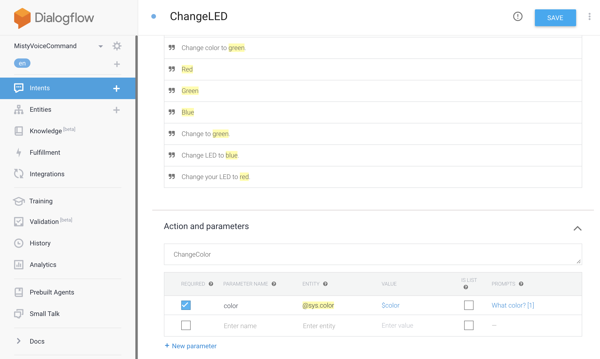
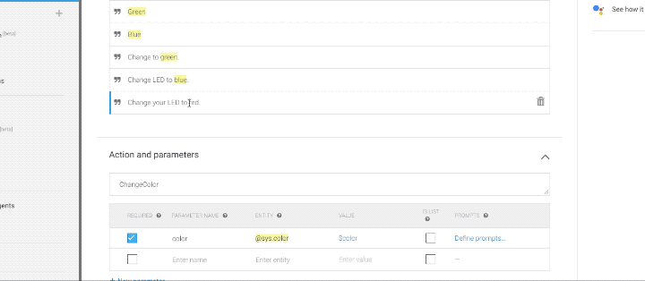
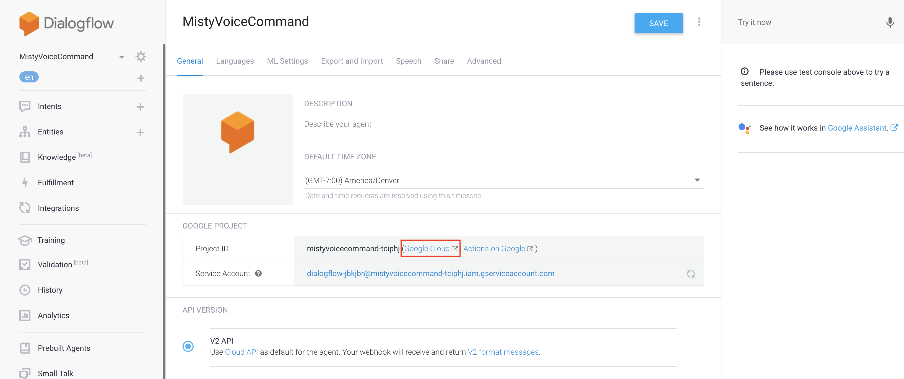
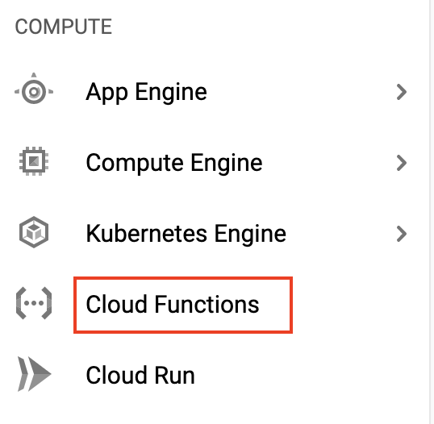
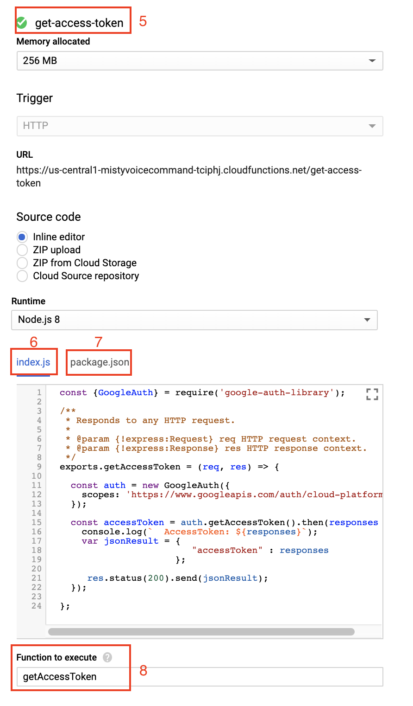

# SimpleVoiceCommand

**SimpleVoiceCommand** is a JavaScript skill for Misty II that integrates with Dialogflow. When it runs, you can activate Misty with her wake word ("Hey, Misty!") and command her to change her LED to a new color ("Change LED to red/green/blue").

The contents of this repository are a modified version of the [misty-conversation](https://github.com/cameron-gq/misty-conversation) skill, which was originally created and shared by [cameron-gq](https://github.com/cameron-gq). This guide, the JavaScript code for the skill, and the code for the Google Cloud function used below all borrow heavily – and in some cases are copied directly – from the original misty-conversation skill.

To run this skill, follow the steps below to set up your own Dialogflow agent. Then, copy the project ID and URL for your agent into your local copy of the `SimpleVoiceCommand.json` meta file.

## Setting Up Dialogflow

### 1. Creating a Dialogflow Agent

The first step in using Dialogflow with our voice command skill is to create a Dialogflow agent to use with our skill. From [Google's developer documentation](https://cloud.google.com/dialogflow/docs/agents-overview):

> "A Dialogflow agent is a virtual agent that handles conversations with your end-users. It is a natural language understanding module that understands the nuances of human language. Dialogflow translates end-user text or audio during a conversation to structured data that your apps and services can understand. You design and build a Dialogflow agent to handle the types of conversations required for your system."

It doesn't take long to set up a Dialogflow agent:

1. If you don't already have one, [sign up for a free Dialogflow account](https://dialogflow.com/).
2. When that's done, select **Create Agent**, and give your new agent a name. (I used "MistyVoiceCommand", but you can call your agent whatever you like.)
3. Select **Create a new Google Project** from the dropdown menu on the agent creation page, and click the blue **Create** button.

### 2. Creating an Intent

The next step is to create what's called an *intent*. In natural language processing, the term *intent* is used to describe a category of expression that a user can provide to interact with your application in a certain way. From the [Dialogflow documentation](https://cloud.google.com/dialogflow/docs/intents-overview):

> "An intent categorizes an end-user's intention for one conversation turn. For each agent, you define many intents, where your combined intents can handle a complete conversation. When an end-user writes or says something, referred to as an end-user expression, Dialogflow matches the end-user expression to the best intent in your agent. Matching an intent is also known as intent classification."

For this basic voice command skill, we create a single intent that allows the agent to handle requests to change Misty's chest LED. In the future, we can add as many intents as we like, so that Misty can respond to a wide variety of voice commands, requests, and other verbal prompts.

Here's how we create the intent for changing Misty's LED:

1. Open the dashboard for your Dialogflow agent. Click **Create Intent**, and give your new intent a name. (Because this intent will handle voice commands for changing Misty's LED color, I called it "ChangeLED")
2. Next, we need to add training phrases, or examples of utterances an end user might speak that we want to map to the ChangeLED intent:  It's a good practice to provide training phrases that model a variety of ways a user could ask Misty to change her LED. From the [Dialogflow documentation](https://cloud.google.com/dialogflow/docs/intents-training-phrases):

> "Training phrases are example phrases for what end-users might type or say, referred to as end-user expressions. For each intent, you create many training phrases. When an end-user expression resembles one of these phrases, Dialogflow matches the intent."

3. Annotate the training phrases to highlight the parameter, or the word(s) with the relevant information for this request. From the [Dialogflow documentation](https://cloud.google.com/dialogflow/docs/intents-actions-parameters):

> When an intent is matched at runtime, Dialogflow provides the extracted values from the end-user expression as [parameters](https://cloud.google.com/dialogflow/docs/intents-actions-parameters#params). Each parameter has a type, called the [entity type](https://cloud.google.com/dialogflow/docs/entities-overview), which dictates exactly how the data is extracted. Unlike raw end-user input, parameters are structured data that can easily be used to perform some logic or generate responses.

When building an agent, you control how data is extracted by annotating parts of your training phrases and configuring the associated parameters.

The parameter for each of our ChangeLED training phrases is the color, so we annotate each color word (i.e. "blue") as a color parameter. This allows Dialogflow to recognize the color words as values that speakers will provide when our skill runs on Misty.



**Note:** In Dialogflow, `color` is a [system entity](https://cloud.google.com/dialogflow/docs/entities-system). This means Dialogflow is configured out-of-the-box to interpret the color words your end-users might use in an utterance. Dialogflow provides several system entities for commonly used parameters, the [full list of which you can find in the Dialogflow documentation](https://cloud.google.com/dialogflow/docs/reference/system-entities). When you create more intents to use with your voice command skill, you may need to create your own custom entities, the details of which will depend on the functionality you are implementing.

1. Next, we scroll down to the Actions and Parameters section to configure the parameters for our intent. Fill out the **Action name** (a reference name for the action that you can use to refer to your action in the logic for systems that interact with your Dialogflow agent) and **Value** (A variable that serves as a placeholder for a parameter's value in other parts of your Dialogflow agent) fields.

With the Dialogflow agent and Intent created, we're ready to set up a Google cloud function to handle incoming requests from our Misty skill.

### 3. Setting up a Google Cloud Platform Function

Google automatically creates a Google Cloud Project and Service Account to handle incoming requests to your Dialogflow agent. Each request you send to your Dialogflow agent requires a unique Access Token – which, by default, only last for one hour. To work around this, we borrow a bit of cleverness from the original conversation skill to create a Google Cloud function that returns a unique Access Token for our Dialogflow project on demand. Each time we run the voice command skill on Misty, it starts by sending a request to this Google Cloud function, so we always have a fresh Access Token to work with.

Follow these steps to set up your cloud function:

1. Open the **settings** page for your Dialogflow agent.
2. Click the link next to the Project ID to open the Google Cloud console for the project. 
3. Select **Cloud Functions** from the Compute menu in the left navigation. (If you do not already have a Google Cloud Platform account, you may be prompted to create a free trial account.) 
4. Click **Create Function**.
5. Name the function **get-access-token**.
6. Copy the below code from the [misty-conversation skill](https://github.com/cameron-gq/misty-conversation/tree/master/google_cloud_function) into the **index.js** editor:

```js
const {GoogleAuth} = require('google-auth-library');

/**
* Responds to any HTTP request.
*
* @param {!express:Request} req HTTP request context.
* @param {!express:Response} res HTTP response context.
*/
exports.getAccessToken = (req, res) => {

  const auth = new GoogleAuth({
    scopes: 'https://www.googleapis.com/auth/cloud-platform'
  });

  const accessToken = auth.getAccessToken().then(responses => {
      console.log(` AccessToken: ${responses}`);
      var jsonResult = {
        "accessToken" : responses
      };
    res.status(200).send(jsonResult);
  });

};
```

7. Copy the below code from the [misty-conversation skill](https://github.com/cameron-gq/misty-conversation/tree/master/google_cloud_function) into the **package.json** editor.

```json
{
  "name": "get-access-token",
  "version": "0.0.1",
  "dependencies": {
    "google-auth-library" : "^5.2.0"
  }
}
```

8. Set the **Function to execute** to **getAccessToken** 
9. Click **Create**.

## Updating the VoiceCommand meta file

Each JavaScript skill you upload to Misty requires two files:

1. A JavaScript file, with the code that runs on the robot
2. A JSON meta file that configures some of the initial settings and parameters that determine how Misty runs the skill code

The JSON meta file for your JavaScript skills can include a Parameters property. This property holds a JSON data object with key/value pairs for additional data you want to use in the skill. You can access these values in your skill code by using the global `_params` variable. To make it easier to share this skill with other developers, we use the Parameters object in the meta file to hold the URL and Project ID for making requests to different Dialogflow agents.

Follow the steps below to replace the values for these variables with the values from your own Dialogflow agent:

1. Open your local copy of the `SimpleVoiceCommand.json` file in a text editor.
2. Open the page for your get-access-token function in the Google Cloud Function and navigate to the **Triggers** tab.
3. Copy the URL for the cloud function and paste it into the `SimpleVoiceCommand.json` meta file as the value for the `getAccessTokenUrl` variable. Then, copy the Project ID from the settings page for your Dialogflow agent and paste it as the value for the `projectID` parameter.

```json
"Parameters": {
  "getAccessTokenUrl": "<your-access-token-URL>",
  "projectID": "<your-project-ID>"
}
```

### Installing the Skill

When you're ready to run the skill, you can [follow these steps to install it](https://docs.mistyrobotics.com/tools-&-apps/web-based-tools/skill-runner/#installing-skills-with-skill-runner) on your robot using the [Skill Runner](http://sdk.mistyrobotics.com/command-center/index.html) web page.

## Improving the SimpleVoiceCommand Skill

This skill demonstrates a very basic integration of Misty's end-of-speech detection with Google's Dialogflow service. A more advanced version of this skill would handle mapping of color strings to byte RGB values, so that Misty could handle more color requests than just red, green, and blue. Other improvements would add more intents to the Dialogflow agent, so that Misty could handle a more interesting variety of commands, including (but not limited to):

* Head movement ("Look at me", "Look up", "look down", "Look left")
* Arm movement ("Raise your left hand")
* Expression ("Play a happy sound", "Make a sad face")
* Locomotion ("Turn around", "Drive straight", "turn left", "Back up")
* Triggering other JavaScript or .NET skills to start ("Start my Hello World skill", "Run my face rec skill")

## Additional Remarks

Thanks to cameron-gq for sharing your skill code and creating an excellent guide to getting started with Dialogflow!